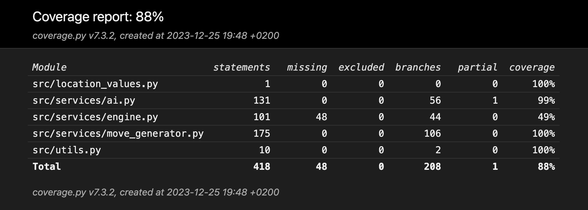
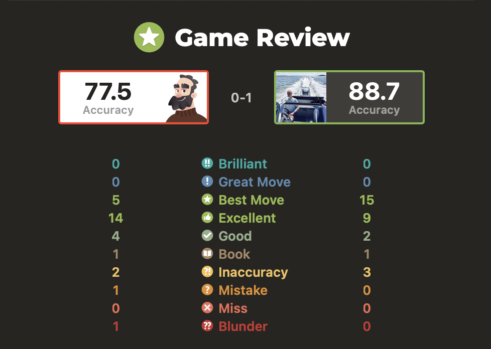
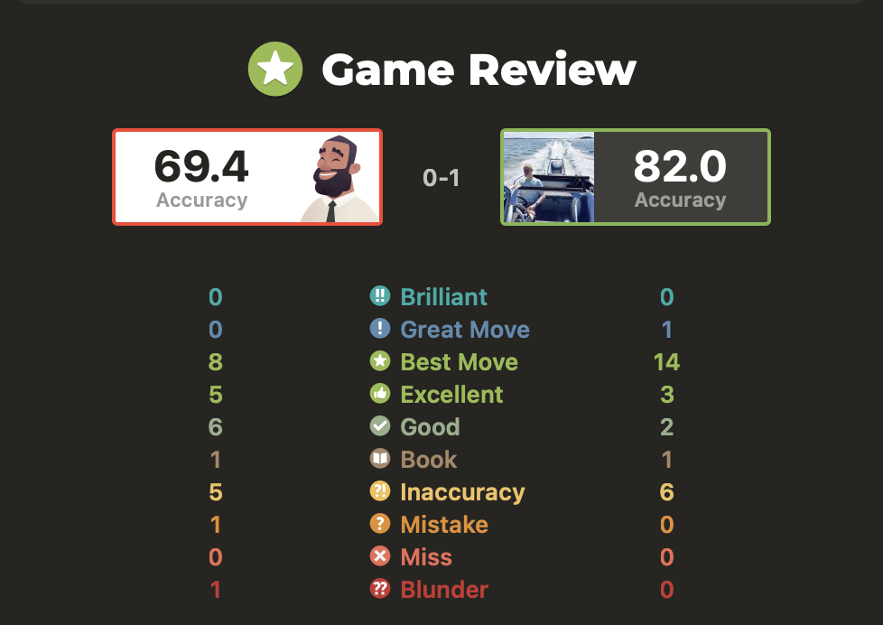
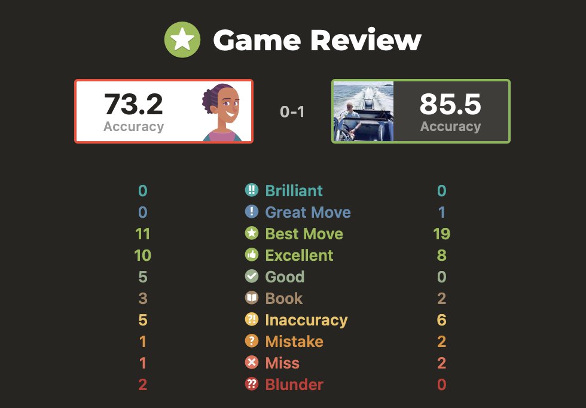

# Testing
Automated testing of this program is implemented as a mixture of unit- and integration-tests. Because of the complex nature of some of the implemented classes, Unittests are not completely limited to testing of single components, apart from the MoveGenerator class. In addition to automated testing this program is also tested manually by playing it against chess.com's bots. These tests measure the Ai's accuracy, and provide a way to measure whether it improves over time.

## Unittests

### Ai
The unittests of this class test, whether the algorithm reacts to selected game states as intended, and selects the correct (best) moves to a given situatiuon. These tests include solving chess puzzles and detecting checkmates. In these unittests, an instance of MoveGenerator class is injected to an instance of Ai. The reason a mock class is not used is the complex nature of the class. More specifically, creating a mock set of valid moves for each recursive alphabeta call is difficult.

### Engine

Unittests of this class mainly test checkmate, stalemate and illegal move detection. these methods are check_end_condition. move_is_legal and validate_move. In these tests, both Ai and MoveGenerator are injected to the Engine class. This is because all these checks use Ai's alphabeta method. Additionally, move_is_legal uses MoveGenerator to check whether the given move is included in pseudo-legal moves.

### MoveGenerator
Unittests for this class are comprehensive, and test that all the methods of the class find all legal moves. This is tested by obstructing pieces' paths with own and opponent's pieces to ensure it doesn't allow moving through material or moving on top of pieces of the same color (pseudo-legal moves). 

### Utils

Utils is a utility file containing several helper functions not bound to a class. Currently these functions are limited to square_to_coordinates and coordinates_to_square, which convert a square to index coordinates (y, x) and vice versa. These functions are tested trivially by ensuring they produce the correct conversions.

## Integration tests

Ai's functionality is also tested with integration tests. These tests are defined in the test_integration.py file. These tests mainly test the combined functionality of Engine and Ai. The test cases commonly originate from blunders that occur in manual testing, such as accuracy tests. The purpose of these tests is to find the root problem of a serious misplay, fix it, and ensure it doesn't happen again. 

# Test coverage
on 18.12.2023 test branch coverage of tested files is 88%.

# Accuracy tests
Accuracy tests test the Ai's performance in real chess games. These tests are manually carried out by passing moves between chess.com's bots and the commandline interface of this app. The purpose of these tests is to measure changes in the Ai's behaviour after changes have been made. These tests also function as benchmarks for how the Ai has improved over time.

## Knight opening blunder (25.11.2023) - fixed
If player plays a standard opening e2e4, the Ai responds with b8c6. If player moves e4e5, the Ai doesn't capture this pawn. Instead it moves g7g6.

## 2.12.2023 Game against martin (250)
THe Ai defeated chess.com's Martin bot in 30 moves on 2.12.2023 playing black.

## 3.12.2023 Game against Nelson (1200)
The Ai defeated Chess.com's Nelson bot in 27 moves on 3.12.2023 playing black.

## 7.12.2023 Game against Isabel (1600)
The Ai defeated Chess.com's Isabel bot in 40 moves on 7.12.2023 playing black.

