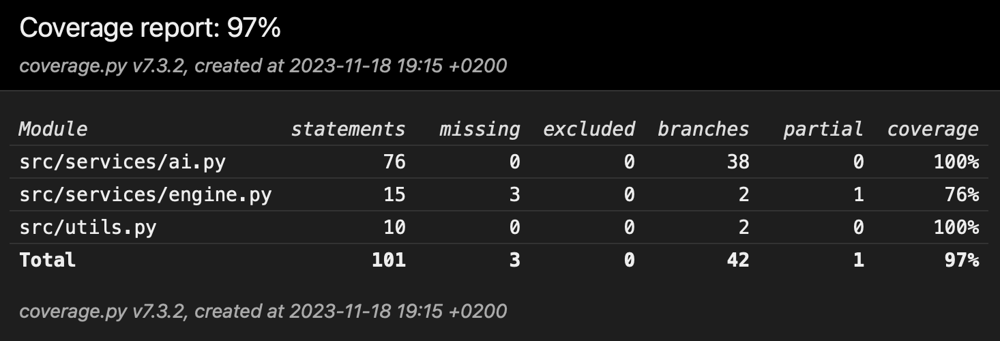

# Testing
Testing of this program is currently limited to unittests of components. Currently, there are 2 classes that are tested: Ai, Engine and engine. Additionally, the helper function file utils.py is tested.

## Unittests

### Ai
The unittests of this class test, whether the algorithm reacts to selected game states as intended. This includes selecting correct moves in chess puzzles, and detecting checkmates.

### Engine

Unittests for this class test that the board gets updated correctly when a move is made. 

### Utils

Utils is a utility file containing several helper functions not bound to a class. Currently these functions are limited to square_to_coordinates and coordinates_to_square, which convert a square to index coordinates (y, x) and vice versa. These functions are tested trivially by ensuring they produce the correct conversions.

# Test branch coverage

