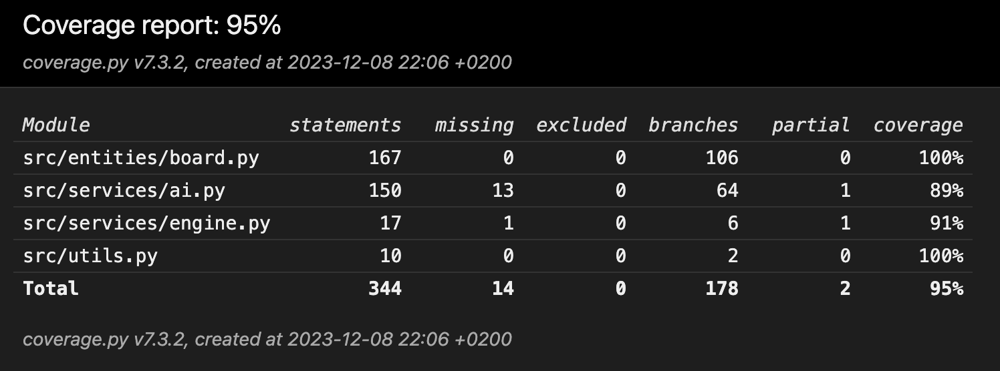

# Testing
Testing of this program is currently limited to unit- and integration tests of components. Currently, there are 3 classes that are tested: Ai, Engine and Board. Additionally, the helper function file utils.py is tested.

## Unittests

### Ai
The unittests of this class test, whether the algorithm reacts to selected game states as intended, and selects the correct (best) moves to a given situatiuon. These tests include solving chess puzzles and detecting checkmates.

### Engine

Unittests for this class test that the board gets updated correctly when a move is made. 

### Board
Unittests for this class are comprehensive, and test that all the methods of the class find all legal moves. This is tested by obstructing piece's paths with own and opponent's pieces to ensure it doesn't allow moving through material.

### Utils

Utils is a utility file containing several helper functions not bound to a class. Currently these functions are limited to square_to_coordinates and coordinates_to_square, which convert a square to index coordinates (y, x) and vice versa. These functions are tested trivially by ensuring they produce the correct conversions.

## Integration tests

Tbe Ai's functionality is also tested with integration tests. These tests are defined in the test_integration.py file. These tests mainly test the combined functinoality of Engine and Ai. The test cases commonly originate from blunders that occur in manual testing, such as accuracy tests.

# Test coverage
on 8.12.2023 test branch coverage of tested files is 95%.

# Accuracy tests
Accuracy tests test the Ai's performance in real chess games. These tests are manually carried out by passing moves between chess.com's bots and the commandline interface of this app. The purpose of these tests is to measure changes in the Ai's behaviour after changes have been made. These tests also function as benchmarks for how the Ai has improved over time.

## Knight opening blunder (25.11.2023) - fixed
If player plays a standard opening e2e4, the Ai responds with b8c6. If player moves e4e5, the Ai doesn't capture this pawn. Instead it moves g7g6.

## 2.12.2023 Game against martin (250)
THe Ai defeated chess.com's Martin bot in 30 moves on 2.12.2023 playing black.

## 3.12.2023 Game against Nelson (1200)
The Ai defeated Chess.com's Nelson bot in 27 moves on 3.12.2023 playing black.

## 7.12.2023 Game against Isabel (1600)
The Ai defeated Chess.com's Isabel bot in 40 moves on 7.12.2023 playing black.

