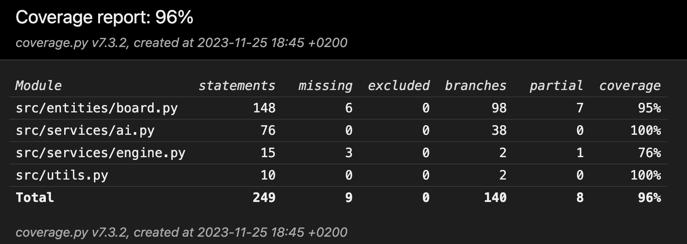

# Testing
Testing of this program is currently limited to unittests of components. Currently, there are 2 classes that are tested: Ai, Engine and engine. Additionally, the helper function file utils.py is tested.

## Unittests

### Ai
The unittests of this class test, whether the algorithm reacts to selected game states as intended, and selects the correct (best) moves to a given situatiuon. These tests include solving chess puzzles and detecting checkmates.

### Engine

Unittests for this class test that the board gets updated correctly when a move is made. 

### Utils

Utils is a utility file containing several helper functions not bound to a class. Currently these functions are limited to square_to_coordinates and coordinates_to_square, which convert a square to index coordinates (y, x) and vice versa. These functions are tested trivially by ensuring they produce the correct conversions.

# Test coverage
on 25.11.2023 test branch coverage of tested files is 96%.

# Accuracy tests
Accuracy tests test the Ai's behaviour in the game. These tests will also include accuracy percentages in games played against chess.com's bots. The purpose of these tests is to find whether the Ai improves over time.

## Knight opening blunder (25.11.2023)
If player plays a standard opening e2e4, the Ai responds with b8c6. If player moves e4e5, the Ai doesn't capture this pawn. Instead it moves g7g6.
